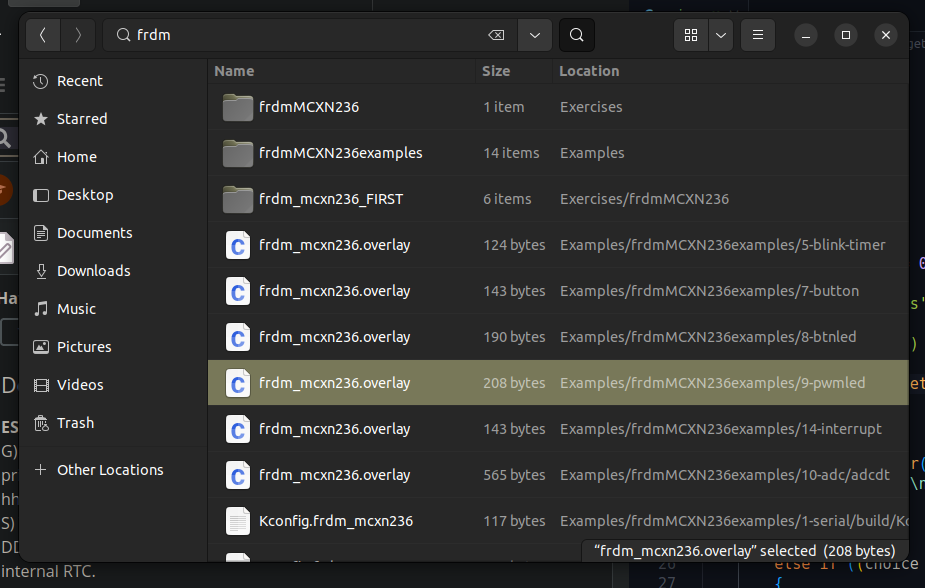

- cmake crash course izle
-  https://www.youtube.com/watch?v=nlKcXPUJGwA
-  https://www.youtube.com/watch?v=SYKj6XZ8y2o
-  basit bir 
-  

# Evde bunu yap
## ESP32-C6
- ESP32-c6 devkit 1 n8,te UART C-portuna bağla
- PlatformIO, Upload & Monitor, terminal acar ve ony kullanarak ESP32nin terminalini izle/monitor.

## MCXN236
- usten, saddaki C-Portuna bagla. [Label'i MCU-Link olan port]
- MCUXpresso[vscode side panel], import repo, zephyr.
/*
Repository:
Zephyr   (https://github.com/zephyrproject-rtos/zephyr)
Revision:
v4.1.0   
Manifest file:
Enter the manifest file name (optional)
Name:
zephyr
Location: home/yaq8bi[Home folder]
*/
- zephyr.dts (Has the device tree source file details, everyty peripheral files merged/combined into one file).

### X'e config project.
[X'e bas,proje folderi ustunde right click, confugure, zephyrSDK path]


---

# Alignment for data types importance for Microcontrollers
uint8_t  - 1 byte
uint16_t - 2 byte

```c++
struct BadAlignment {
    uint8_t a;
    uint16_t b;
    uint8_t c;
};

struct GoodAlignment {
    uint16_t a; /2byte
    uint8_t b;
    uint8_t c;
}
```

NON-Volatile memory examples include: Flash memory(SD-card), EEPROM(Electrically Erasable Programmable O Memory) and ROM.
Volatile memory examples include: RAM and Cache memory.


---

# data transfer

- Use voltage signals for data transfer.

- Sample rate: sample rate to mark the voltage signal 
- Frequency: Number cycles per second.  = V(voltage) * I(current).

- DAC: Digital to analog converter.
- ADC: Analog to digital converter.


# Micro
### Interrupt
- Pins changed state, the microcontroller will stop what it is doing and execute the interrupt service routine, returning to the main program when the interrupt is complete.
- Polling: The microcontroller checks the pin state in a loop. This is stupid and inneficient.
- INterrupt: The microcontroller is interrupted when the pin state changes.
  
  #### We should minimize uses of INTERUPTS, as in EMBEDDED SYSTEMS, safety is the most important thing.
##### Yani, Interrupt, bir event gerceklestiginde interrupt edilir, bi nevi task switching gibi.
##### Multiple instances of interupts can be managed by priority levels.

---

# Platform IO
- PlatformIO is an open source ecosystem for IoT development.
```c
void app_main() {}

int main(void){

    app_main(); // Bootloader
/*  For ever looop to not get out of  the program in the ESP32
    Alot of steps happen before.
*/
    while (1) 
    {
        printf("no");
    }
    
}
```
---

### Inseead of normal sleep, we use the sleep below, to not stop the program, instead we just stop the task and then continue doing the rest:
```c
#include <stdio.h>
#include <esp_timer.h>
#include <esp_task_wdt.h>

extern "C" void app_main(void) // extern C means its a C function[ Tells the compiler, don't change the name of the function. Because ussually compilers change names. (Only main is called in the boot loader. )]
{
    // Exclude the Idle Task from the Task WDT
    //  You can also do it by running: pio run -t menuconfig
    //  Component Config -> ESP System Settings -> Watch CPU0 Idle Task
    ESP_ERROR_CHECK(esp_task_wdt_delete(xTaskGetIdleTaskHandle()));

    uint64_t counter{0};
    int64_t current, prevoius{0};
    constexpr int64_t INTERVAL{1000000}; // 1 second

    while (1)
    {
        current = esp_timer_get_time();

        if (current - prevoius >= INTERVAL)
        {
            printf("Counter value at %lld μs = %llu\n", current, counter);
            prevoius = current;
        }

        counter++;
    }
}

```

## READ and ANALYZE the code:


```c
time_t now={0}; //  time_t is a data type that represents time in seconds since the epoch (00:00:00 UTC on 1 January 1970).
struct tm *_infoOfTime = localtime(&now); // is a function that converts a time_t value to a struct tm, which contains the broken-down time representation.
```
- 1. Get the current time using time(&now).
- 2. Convert the time to a human-readable format using 